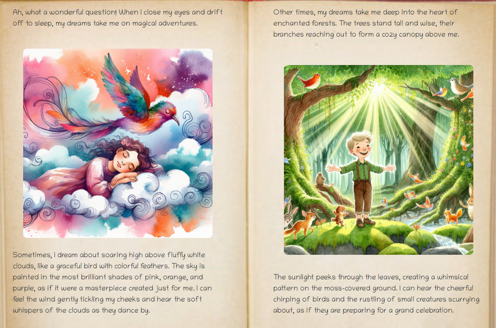
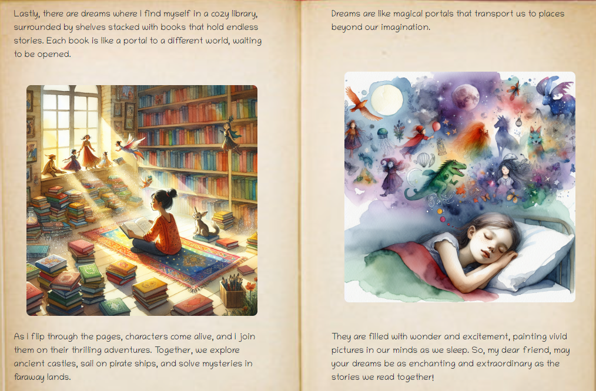

<h1>StoryBook.ai</h1>

 

  An automatically generated story book with illustrations to answer children's questions. Uses OpenAI's api to create an educational children's book with illustrations. Operates as a full stack Vite application, utilizing JSWT timed session validation, image uploading with an AWS S3 bucket, and stores users' creations in a MongoDB cluster.
    

<!-- ABOUT THE PROJECT -->
## About The Project

I built this project out of a passion for finding better ways to satisfy curiosity. I know when I was younger I had countless questions go unanswered. Kids deserve to be heard and get high quality, correct answers. But that being said, the internet can be a dangerous place for children. I built this as something parents could trust to give appropriate information, and invoke a sense of wonder and imagination, all well educating. . The ability to incorporate custom individualized aspects to each user's story really shows the potential of these generative technologies.

### Prerequisites
You will need:
<ul>
  <li>An Open AI account</li>
    <li>An AWS account</li>
    <li>A MongoDB account</li>
</ul>

### Installation

1. Get the repo.
2. Populate the .env with your info.
3. Configure the config file to match your DB info.
4. In the client folder:
   <ul>
     <li>npm install</li>
     <li>npm run dev</li>
   </ul>
5. In the server folder:
<ul>
  <li>npm install</li>
  <li>npx nodemon</li>
</ul>

<!-- USAGE EXAMPLES -->
## Usage
Use this to replace internet access in children 10 and younger. Designed to give engaging, customized, age appropriate educational content. 

(<a href="#readme-top">back to top</a>)

<!-- CONTRIBUTING -->
## Contributing

Contributions are what make the open source community such an amazing place to learn, inspire, and create. Any contributions you make are **greatly appreciated**.

If you have a suggestion that would make this better, please fork the repo and create a pull request. You can also simply open an issue with the tag "enhancement".
Don't forget to give the project a star! Thanks again!

1. Fork the Project
2. Create your Feature Branch (`git checkout -b feature/AmazingFeature`)
3. Commit your Changes (`git commit -m 'Add some AmazingFeature'`)
4. Push to the Branch (`git push origin feature/AmazingFeature`)
5. Open a Pull Request

(<a href="#readme-top">back to top</a>)

